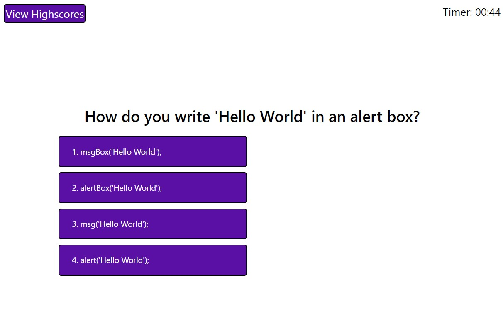

# Changeling004# Changeling004

Changeling - A word of play for 'Challenging'

003 - Natural number following 003 (The previous challenge in this course) 

 ##  Links to Repo and deployment📌

* GitHub Repository link https://github.com/jmdg1023/Changeling004

* Site is live at https://jmdg1023.github.io/Changeling004/

## Learning Resources
* https://www.youtube.com/watch?v=RswgVWKJRLM&t=436s
* https://www.youtube.com/watch?v=_LYxkClHnV0&t=193s
* https://www.youtube.com/watch?v=AFTvxsVv52k&t=6015
* https://www.youtube.com/watch?v=pQr4O1OITJo

## What this Generate Password site does 💡💡💡

1. A homepage is seen where you can click the start button when you are ready for the quiz.

2. Timer automatically starts when the start button is clicked and user is presented with a question.

3. Once question is answered, the next question will be presented. 

4. If user answwered incorrectly, the time will be subtracted from the clock.

5. A score of 10 will be obtained everytime the user answwers correctly.

6. The game will be over once all questions are answered or the timer reaches 0.
    User can then save their initials and score.

7. Once submitted score will be added in the Highscore list. Button "Clear Highscores" can be clicked to empty the highscorelist.

